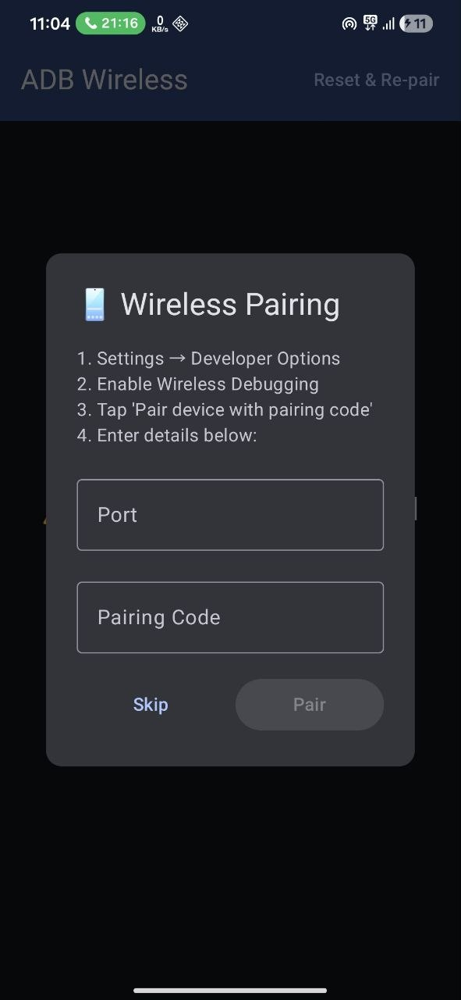
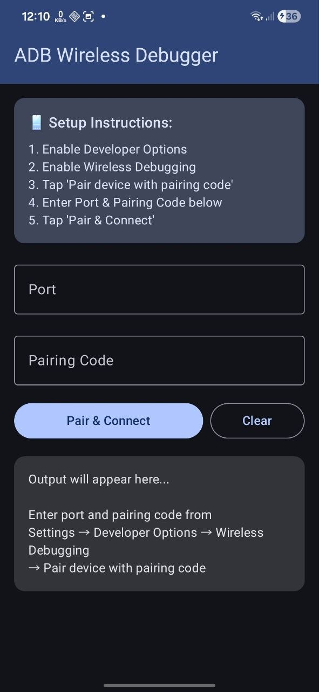
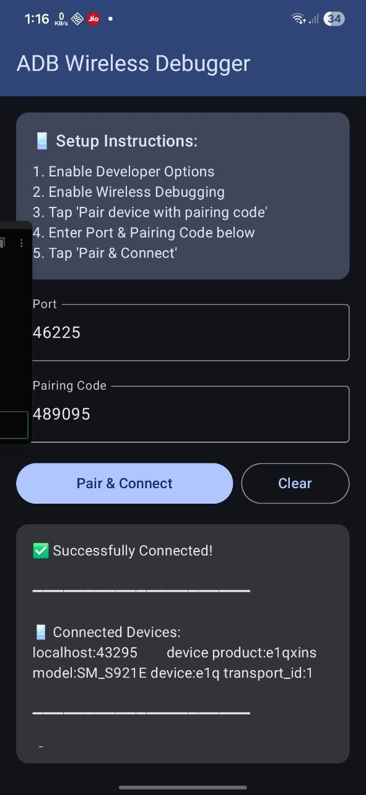

# 📱 Wide-R

Wide-R is an Android utility that simplifies wireless debugging (ADB over Wi-Fi) by enabling developers to connect and test applications on remote client devices—even when both are not on the same local network.

---

## 🚀 Overview

Android’s native wireless debugging requires both the developer’s machine and the target device to be connected to the same Wi-Fi network. This becomes a major limitation when working with remote clients or distributed teams.

Wide-R solves this problem by abstracting the networking layer and automating the debugging setup, allowing seamless remote connections between Android Studio and client devices.

---

## 📸 Preview

  
  
  

## 💡 Key Features

- 🔗 Connect to Android devices across different networks
- ⚡ One-tap wireless debugging setup
- 🌐 Creates a shared network layer between developer and client
- 🔁 Handles dynamic to stable IP configuration
- ⚙️ Automates required system-level commands internally
- 🖥️ Enables real-time screen mirroring
- 📲 Works with Android Studio for direct app deployment & testing

---

## 🧠 How It Works

1. The client installs and opens the Wide-R app.
2. The app prepares the device by:
   - Enabling wireless debugging
   - Configuring necessary network parameters
3. A virtual/shared network layer is established.
4. The developer connects to the device via Android Studio using the provided endpoint.
5. Once connected:
   - Apps can be installed remotely
   - Logs can be monitored (Logcat)
   - Screen mirroring becomes available

---

## 🛠️ Tech Stack

- Android (Java/Kotlin)
- ADB (Android Debug Bridge)
- Termux (for executing system-level commands)
- Network tunneling / IP management

---

## 📌 Use Cases

- 👨‍💻 Freelancers working with remote clients
- 🧪 QA testing on real devices from different locations
- 🌍 Distributed development teams
- 📱 Debugging apps without physical access to device

---

## ⚠️ Requirements

- Android 11 or higher (for wireless debugging support)
- Developer options enabled on the client device
- Stable internet connection on both ends
- User consent for debugging permissions

---

## 🔐 Disclaimer

Wide-R is intended only for development and testing purposes.  
Users must ensure they have proper authorization before connecting to any device.  
The app does not promote or support unauthorized access.

---

## 📈 Future Plans

- 🔒 Secure authentication layer
- 🎨 Improved UI/UX
- 🖥️ Desktop companion tool
- 📡 Better connection stability & performance

---

## 🤝 Contributing

Contributions are welcome!  
Feel free to open issues, suggest features, or submit pull requests.

---

## ⭐ Support

If you find this project useful, consider giving it a star ⭐